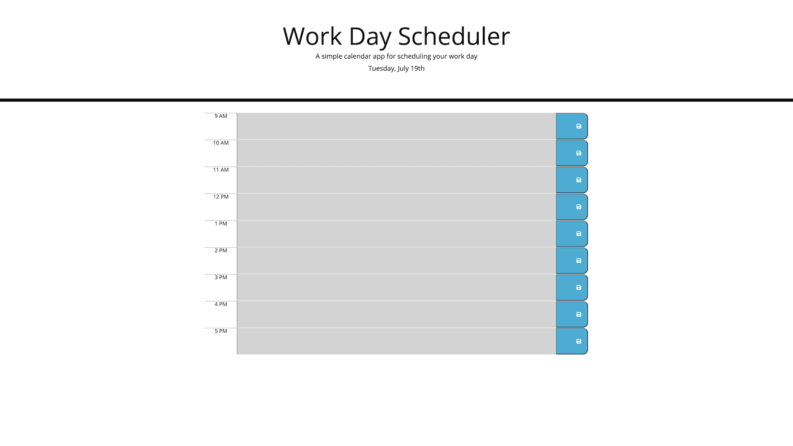

# Homework 5

For Homework 5 in the Berkeley Coding Bootcamp, I created a calendar application that allows one to save events in a daily planner for each hour of the day from 9 AM to 5 PM. Events saved in the planner will still appear even when the page is refreshed or reloaded.

The app runs in the browser and uses dynamically updated HTML and CSS powered by jQuery. The app uses [Moment.js](https://momentjs.com/) to dynamically update the time and date.

Link to deployed application: https://dan-to-github.github.io/homework-5/